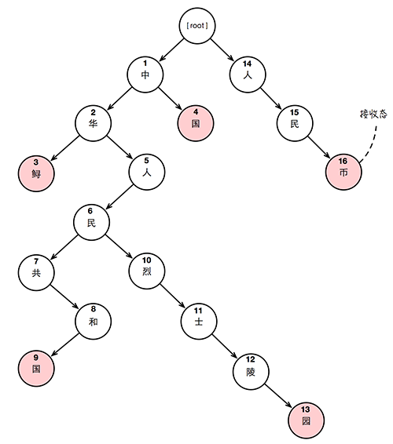
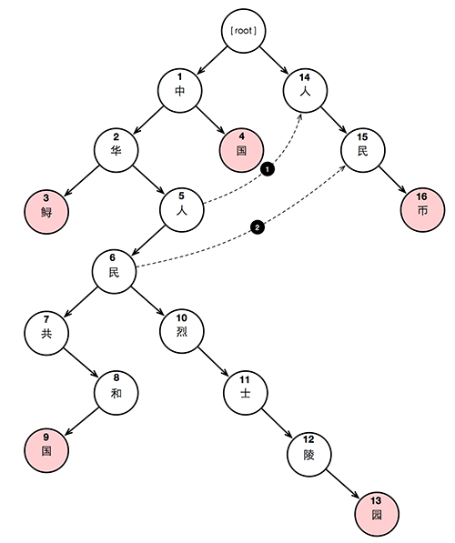

# 敏感词过滤

## 使用方式
在需要使用敏感词过滤的模块中依赖本模块.
```xml
<dependency>
  <groupId>net.watertao.diablo</groupId>
  <artifactId>sensitive-word-filter</artifactId>
  <version>1.0-SNAPSHOT</version>
</dependency>
```
本模块并没有部署到 maven 中央仓库,故需要使用者将其部署到自己的私服或导入到自己的工程中.

```java
// 敏感词文件,目前只支持行分隔的文件格式
InputStream in = Test.class.getResourceAsStream("/sensitive-words.txt");

// 创建过滤器实例
LineSeparationSensitiveWordFilter sensitiveWordFilter = new LineSeparationSensitiveWordFilter(in, Charset.forName("UTF-8"));
// 构建过滤器 aho-corasick trie 树结构
// 当我们需要更新敏感词列表的时候,可以再次调用此方法进行 Trie 结构的重构
sensitiveWordFilter.build();

// 
String text = "从root节点开始，xi近平每次根据读入的字符沿着自动机向下移动。当读入的字符，在分支中不存在时，递归走失败路径。如果走失败路径走到了root节点，则跳过该字符，处理下一个字符。因为AC自动机是沿着输入文本的最长后缀移动的，所以在读取完所有输入文本后，最后递归走失败路径，直到到达根节点，这样可以检测出所有的模式。我们可以发现，当采用了失败路径的AC算法，比不采用失败路径的AC算法其查找效率会更高，尤其是对于模式串列表中的模式串其重复程度比较高（比如 中华人民共和国，人民币，其中人民两个字符是重复的）的情况下，效果更为突出。一句话来概括设定失败路径：假设某个节点上的字符为 s，沿着他父亲的失败指针走，直到走到一个节点，它的直接子节点中也有字符为 s 的节点。然后把当前节点的失败指针指向那个字符也为 s 的节点。如果一直走到了root节点都没找到，那就把失败指针指向root。我们来看看 平台虚拟化，平台虚拟化就是我们常见的 vmware workstation, vmware esx, virtualbox, xen 等，他们的特点都是通过在硬件上直接或间接运行多个操作系统来达到隔离的效果，因为大家都知道 应用程序本身是没有权限直接访问硬件的，CPU，内存以及其他IO设备，它们要访问这些资源必须调用操作系统内核所提供的所谓的 system call 界面，那么如果我们在硬件上坐两个操作系统，那么分别位于这两个操作系统之上的应用程序之间肯定是被隔离的了，当然前提是这两个操作系统本身之间是被隔离的。\n" +
  "由于现代操作系统基本上都是本着在硬件上单独运行西藏一西藏独立个内核实例的思想开发的，那么如何在不改动或尽量少改的情况下让现有操作系统可以在一个物理服务器上运行多个内核实例呢？ 答案就是将硬件虚拟化，并可以隔离切分为多个，让操作系统以为这些虚拟的硬件设备如同真正的设备，并能在此之上运行。\n" +
  "而这个将物理硬件虚拟化为虚拟硬件的玩意儿被称之为 hypervisor 或 VMM(virtual machine monitor)。hypervisor 虚拟化按照安装的分层位置可以分为两类，一类是如同操作系统一般，可以直接安装在硬件之上的，被称为 bare metal 落机虚拟机，一种是安装在操作系统之上的，被称之为 HOSTED 主机虚拟机。如果按照虚拟机的虚拟度，可分为 全虚拟化（虚拟机模拟了完整的底层硬件，包括 处理器，内存，时钟，外设等，这种模式下，guest os 无需任何修改即可安装，比较著名的有vmware workstation, virtual box, parallels），部分虚拟化（虚拟机只虚拟了部分硬件，因此 guest os 必须要做必要的修改才能安装运行），在实现虚拟化的时候，有些是采用了纯软件虚拟，有些则可借助硬件的虚拟化技术提高虚拟性能，比如 Intel-VT, AMD-V，这些都是芯片中的 chip-assist。\n" +
  "平台虚拟化中还有一个叫做 操作系统级虚拟化，所有的进台独程台独本质上是在同一个操作系统的实例中运行，内核通过创建多个虚拟的操作系统实例（内核和库）来隔离不同的进程，让这些进程互相之间不了解对方的存在，比较著名的有 Solaris Container OpenVZ等\n" +
  "上面就是平台虚拟化，其本质上就是让进程觉得自己在不同的操作系统内核下执行。";
Collection<MatchPoint> matchPoints = sensitiveWordFilter.findSensitiveWord(text);

for (MatchPoint mp : matchPoints) {
  System.out.println(mp.getWord() + "(" + mp.getStart() + ":" + mp.getEnd() + ")");
}
```
输出:
```
xi近平(10:13)
西藏独立(683:686)
台独(1261:1262)
台独(1264:1265)
```
上面的输出列表中括号里是字符在文本中所处的位置.

## 敏感词源文件格式扩展
目前只实现了行分隔的敏感词源文件格式, 倘若要实现其它格式的文件,那么可以实现 `SensitiveWordPatternReader` 接口,然后在构造 Filter 的时
候把这个 Reader 的实例传入即可.


## 关于 aho-corasick 算法
如果简单的使用 String.indexOf 或 正则表达式来进行匹配, 性能上并不算高效.目前主流的多模匹配算法就是 aho-corasick .

该算法主要分为三个步骤:
1. 建立模式的 Trie 树
2. 给 Trie 树添加失败路径
3. 根据 AC 自动机,搜索待处理的文本

### 建立模式的 Trie


如上图，Trie 是一棵树型结构，通过将模式串中的各个模式按照字符分解一一建立。
需要注意的是，红色的节点代表着一个模式串的结束标志，包含这个结束标志的节点的状态称为为接收态。

### 为 Trie 添加失败路径


首先我们看一下失败路径是按照什么规则添加的
一句话来概括设定失败路径：假设某个节点上的字符为 s，沿着他父亲的失败指针走，直到走到一个节点，它的直接子节点中也有字符为 s 的节点。然后把当前节点的失败指针指向那个字符也为 s 的节点。如果一直走到了root节点都没找到，那就把失败指针指向root。
上图中省略了失败指针指向 root 的路径虚线，而只画出了失败路径指向非 root 的虚线。
先看看 2 号节点’华’是如何确定失败指针为 root 的，首先找到其父节点（1号节点”中”），1号节点的失败指针指向 root (上图中省略了虚线)，而 root 节点下并不存在直接子节点的字符为”华”，所以2号节点的失败指针也指向 root。
再看看 5号节点“人”的失败指针如何设定，首先找到其父节点（2号节点“华”），2号节点的失败指针指向 root，而 root 节点下存在一个直接子节点字符为“人”，所以讲 5号节点的失败指针指向这个“人”节点，也就是14号节点。
最后看看6号节点“民”的失败指针如何设定，首先找到其父节点（5号节点“人”），5号节点的失败指针指向 14号节点，而14号节点的直接子节点中包含字符为“民”的节点，所以6号节点的失败指针指向这个“民”节点，也就是15号节点。

接着我们看一下,如果不存在失败路径的设定,当我们要对连续字符"哈哈中华人民币"进行模式匹配的时候,我们需要几步(没有完全分解为机器指令,只是简单的逻辑步骤,但足以说明性能问题)?
1. 获取连续字符中的第一个字符”哈“
2. 查找 root 下是否存在直接子节点的字符为”哈“，结果为不存在
3. 获取连续字符中的第二个字符”哈“
4. 查找 root 下是否存在直接子节点的字符为”哈“，结果为不存在
5. 获取连续字符中的第三个字符”中“
6. 查找 root 下是否存在直接子节点的字符为”中“，结果为存在（节点1），记录当前的字符处理索引为第三个字符
7. 判断节点1是否为接收态，结果为不是
8. 获取连续字符中的第四个字符”华“
9. 查找节点1下是否存在直接子节点的字符为”华“，结果为存在（节点2）
10. 判断节点2是否为接收态，结果为不是
11. 获取连续字符中的第五个字符”人“
12. 查找节点2下是否存在直接子节点的字符为”人“，结果为存在（节点5）
13. 判断节点5是否为接收态，结果为不是
14. 获取连续字符中的第六个字符”民“
15. 查找节点5下是否存在直接子节点的字符为”民“，结果为存在（节点6）
16. 判断节点6是否为接收态，结果为不是
17. 获取连续字符中的第七个字符”币“
18. 查找节点6下是否存在直接子节点的字符为”币“，结果为不存在
19. 获取当前字符处理索引+1的字符，也就是第四个字符”华“
20. 查找 root 下是否存在直接子节点的字符为”华“，结果为不存在
21. 获取连续字符中的第五个字符”人“
22. 查找 root 下是否存在直接子节点的字符为”人“，结果为存在（节点14），记录当前的字符处理索引为第五个字符
23. 判断节点14是否为接收态，结果为不是
24. 获取连续字符中的第六个字符”民“
25. 查找节点14下是否存在直接子节点的字符为”民“，结果为存在（节点15）
26. 判断节点15是否为接收态，结果为不是
27. 获取连续字符中的第七个字符”币“
28. 查找节点15下是否存在直接子节点的字符为”币“，结果为存在（节点16）
29. 判断节点16是否为接收态，结果为是
30. 匹配到模式”人民币“

### 根据AC自动机，搜索待处理文本
上面已经列出了如果没有使用失败路径的时候，完成上例中的模式匹配大约需要30步，而使用了失败路径又能快多少呢？
同样对上面的连续字符进行处理，当我执行到第18步的时候，发现节点6下并不存在直接子节点的字符为”币“，这时候：

- 查找节点6的失败指针指向的节点（15号节点）下是否存在直接子节点的字符为”币“，结果为存在（15号节点）
- 判断节点16是否为接收态，结果为是
- 匹配到模式”人民币“

我们可以发现，当采用了失败路径的AC算法，比不采用失败路径的AC算法其查找效率会更高，尤其是对于模式串列表中的模式串其重复程度比较高（比如 中华人民共和国，人民币，其中人民两个字符是重复的）的情况下，效果更为突出。

简单的概括处理的流程为：
从root节点开始，每次根据读入的字符沿着自动机向下移动。当读入的字符，在分支中不存在时，递归走失败路径。如果走失败路径走到了root节点，则跳过该字符，处理下一个字符。因为AC自动机是沿着输入文本的最长后缀移动的，所以在读取完所有输入文本后，最后递归走失败路径，直到到达根节点，这样可以检测出所有的模式。
